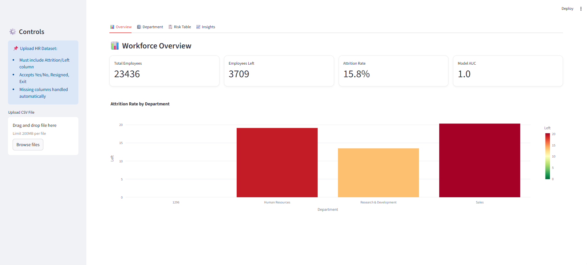
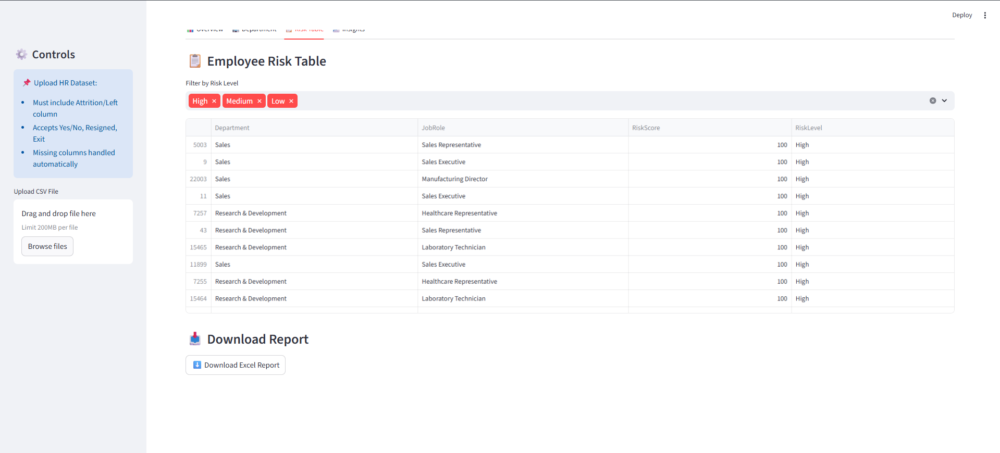
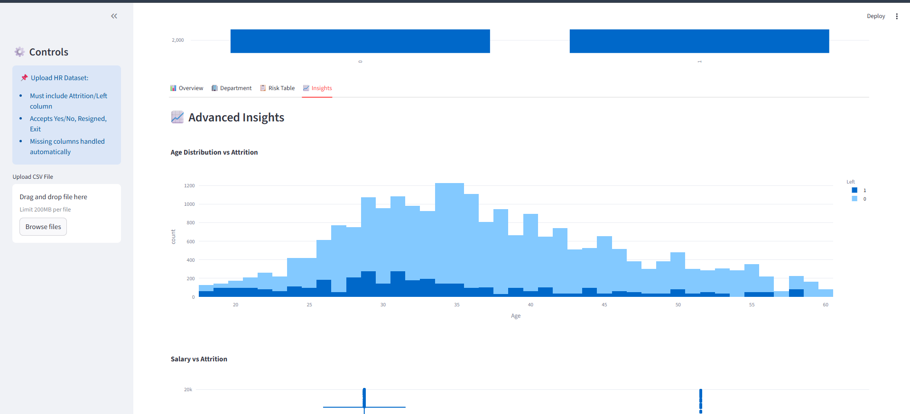
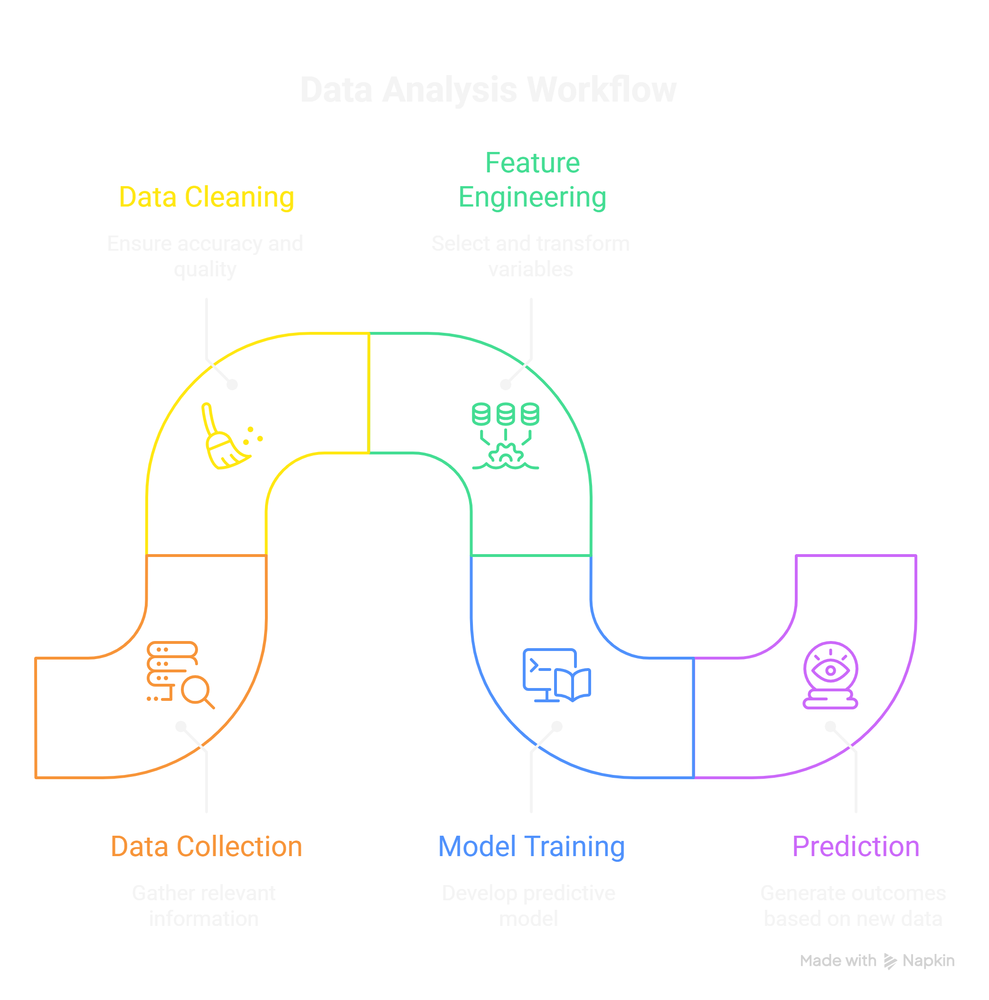
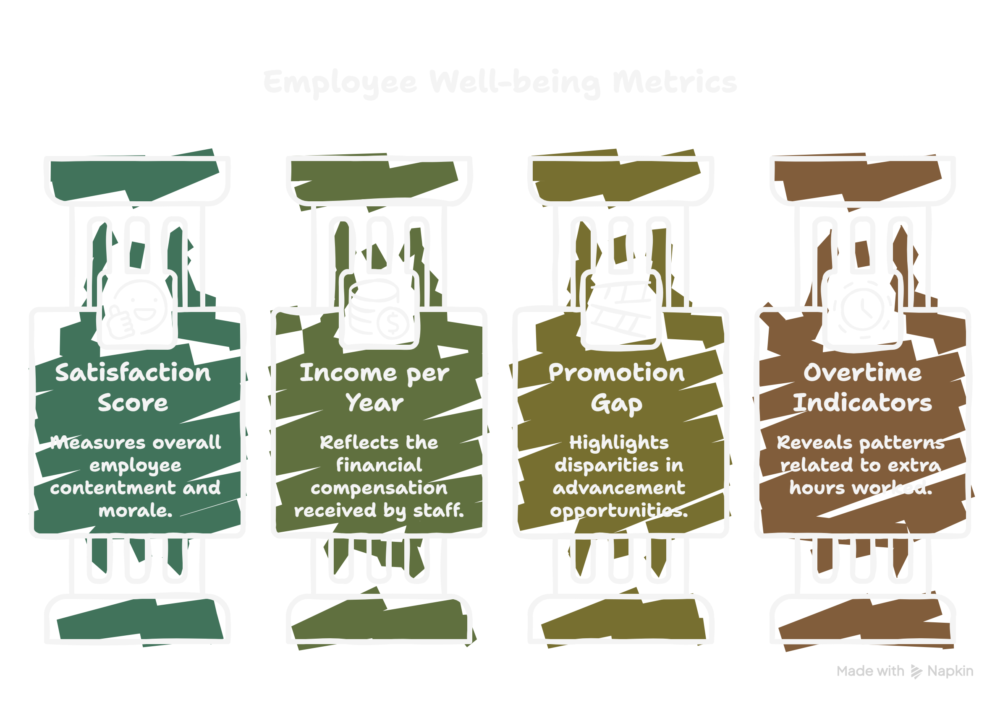

# 👥 Employee Attrition Prediction & Workforce Analytics

A complete **Machine Learning + Data Analytics Dashboard** built using **Python, Streamlit, and Scikit-learn** to predict employee attrition and provide actionable workforce insights.

---

## 🚀 Project Overview

Employee attrition is a critical challenge for organizations. This project helps:

* Predict which employees are likely to leave
* Identify key drivers of attrition
* Visualize workforce insights
* Enable data-driven HR decisions

---

## 🎯 Key Features

### 🔍 Machine Learning

* Random Forest model for prediction
* Automatic preprocessing
* Feature engineering pipeline
* ROC-AUC evaluation

### 📊 Interactive Dashboard

* Multi-tab Streamlit UI
* Real-time filters
* Visual analytics using Plotly

### 🧠 Smart System

* Dynamic column mapping
* Handles missing columns
* Works with different dataset formats

### 📥 Export Feature

* Download results as Excel report

---

## 📊 Dashboard Preview

### 🔹 Overview Dashboard


### 🔹 Department Analysis



### 🔹 Risk Table



### 🔹 Insights



---

## 🤖 Machine Learning Workflow

This project follows a structured ML pipeline:

1. Data Collection
2. Data Cleaning
3. Feature Engineering
4. Model Training
5. Prediction
6. Evaluation

### 📈 Workflow Diagram



---

## 🧠 Feature Engineering

To improve model performance, new features are created:

* Satisfaction Score
* Income Per Year
* Promotion Gap
* Overtime Indicators

### 📊 Feature Engineering Visualization



---

## 🏗️ Project Structure

```
employee-attrition-ml/
│
├── app.py
├── config.py
├── requirements.txt
│
├── data/
│   └── ibm_hr_data.csv
│
├── src/
│   ├── data_processing.py
│   ├── feature_engineering.py
│   ├── model.py
│   ├── prediction.py
│   ├── schema_mapper.py
│   └── utils.py
│
├── reports/
│   └── excel_report.py
│
└── assets/
    ├── styles.css
    └── images/
```

---

## ⚙️ Installation & Setup

### 1️⃣ Clone Repository

```
git clone https://github.com/your-username/employee-attrition-ml.git
cd employee-attrition-ml
```

### 2️⃣ Install Dependencies

```
pip install -r requirements.txt
```

### 3️⃣ Run Application

```
streamlit run app.py
```

---

## 📂 Dataset Requirements

* Must include **Attrition column**
* Supports:

  * Yes / No
  * Resigned / Exit

### Example Features:

* Age
* Department
* JobRole
* MonthlyIncome
* OverTime

---

## 📈 Example Output

| Department | Job Role  | Risk Score | Risk Level |
| ---------- | --------- | ---------- | ---------- |
| Sales      | Manager   | 78.5%      | High       |
| HR         | Executive | 42.3%      | Medium     |

---

## 🛡️ Robustness

* Handles missing columns
* Handles unknown values
* Prevents crashes
* Displays clear error messages

---

## 🎯 Use Cases

* HR Analytics
* Workforce Planning
* Attrition Risk Monitoring
* Employee Retention Strategy

---

## 🔥 Future Enhancements

* SHAP Explainability
* PDF report generation
* Live deployment
* Advanced filtering

---

## 🧑‍💻 Tech Stack

* Python
* Pandas, NumPy
* Scikit-learn
* Streamlit
* Plotly

---

## 🙌 Author

**Alok Rana**
Aspiring Data Scientist & ML Developer

---

## ⭐ Support

If you like this project, give it a ⭐ on GitHub!
